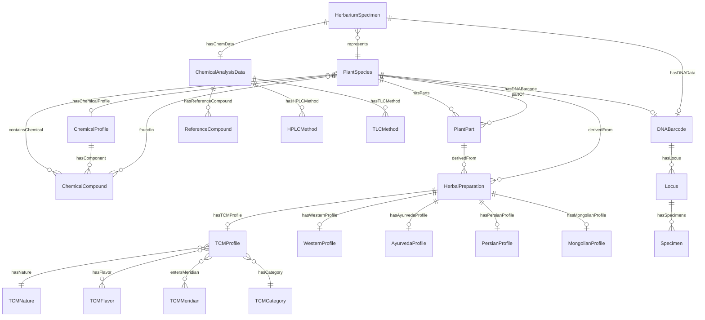

# Herbapedia Ontology Documentation

> Comprehensive documentation of the Herbapedia data model, entity relationships, and linked data architecture.

## Table of Contents

1. [Executive Summary](#executive-summary)
2. [Architecture Overview](#architecture-overview)
3. [Entity Hierarchy](#entity-hierarchy)
4. [Core Object Types](#core-object-types)
5. [Data Linking Patterns](#data-linking-patterns)
6. [Normalized Database Structure](#normalized-database-structure)
7. [Vocabulary and Ontology Terms](#vocabulary-and-ontology-terms)
8. [Entity Relationship Diagrams](#entity-relationship-diagrams)
9. [Examples of Linked Data](#examples-of-linked-data)
10. [Medicine System Profiles](#medicine-system-profiles)
11. [Identification Methods](#identification-methods)
12. [Specimen and Reference Data](#specimen-and-reference-data)

---

## Executive Summary

The Herbapedia ontology is a semantic data model designed to represent:

1. **Botanical Knowledge**: Plant species, parts, and chemical constituents
2. **Herbal Preparations**: Processed plant materials used in medicine
3. **Medicine System Profiles**: Interpretations of preparations across TCM, Western, Ayurveda, Persian, and Mongolian medicine
4. **Identification Methods**: Analytical techniques for authentication (DNA barcoding, HPLC, TLC)
5. **Reference Compounds**: Chemical standards used in quality control

### Key Design Principles

- **OOP Architecture**: Entity-based model with clear inheritance hierarchies
- **MECE (Mutually Exclusive, Collectively Exhaustive)**: No overlapping data, no gaps
- **Linked Data**: All entities interconnected via IRI references (`@id`)
- **HerbalPreparation as Central Pivot**: Single preparation can have multiple system profiles

---

## Architecture Overview

### High-Level Architecture

```
+-----------------------------------------------------------------------------+
|                        HERBAPEDIA ENTITY ARCHITECTURE                        |
+-----------------------------------------------------------------------------+
|                                                                              |
|  +------------------------- BOTANICAL LAYER ------------------------+       |
|  |                                                                   |       |
|  |  PlantSpecies (Botanical Facts Only)                             |       |
|  |    |                                                              |       |
|  |    +-- hasParts --> PlantPart (specific part of specific plant)  |       |
|  |    |                    |                                         |       |
|  |    |                    +-- containsChemical --> ChemicalCompound |       |
|  |    |                    +-- hasChemicalProfile --> ChemicalProfile|       |
|  |    |                                                              |       |
|  |    +-- containsChemical --> ChemicalCompound                      |       |
|  |    |            |                                                 |       |
|  |    |            +--<-- foundIn (bidirectional)                    |       |
|  |    |                                                              |       |
|  |    +-- hasDNABarcode --> DNABarcode                               |       |
|  |                                                                   |       |
|  +-------------------------------------------------------------------+       |
|                              |                                               |
|                              | derivedFrom                                   |
|                              v                                               |
|  +----------------- HERBAL PREPARATION LAYER ------------------+            |
|  |                                                                  |            |
|  |  HerbalPreparation (Central Pivot Entity)                        |            |
|  |    |                                                              |            |
|  |    +-- derivedFrom --> PlantSpecies | PlantPart                  |            |
|  |    |                                                              |            |
|  |    +-- preparationMethod: "dried", "fresh", "extract"...         |            |
|  |    |                                                              |            |
|  |    +-- form: "powder", "tincture", "tea", "capsule"...           |            |
|  |    |                                                              |            |
|  |    +-- has*Profile --> System-Specific Profiles                  |            |
|  |                                                                  |            |
|  +------------------------------------------------------------------+            |
|                              |                                               |
|          +-------------------+------------------+---------------+            |
|          v                   v                  v               v            |
|  +--------------+  +--------------+  +--------------+  +--------------+     |
|  | TCMProfile   |  |WesternProfile|  |AyurvedaProfile| |PersianProfile|     |
|  |              |  |              |  |              |  |              |     |
|  | profiles --- |  |              |  |              |  |              |     |
|  | hasNature    |  | hasAction    |  | hasRasa      |  |hasTemperament|     |
|  | hasFlavor    |  | hasOrganAff. |  | hasVirya     |  | hasElement   |     |
|  | entersMerid. |  |              |  | hasVipaka    |  | hasDegree    |     |
|  | hasCategory  |  |              |  | hasGuna      |  |              |     |
|  +--------------+  +--------------+  +--------------+  +--------------+     |
|                                             +---------------+                |
|                                             | MongolianProfile|              |
|                                             +----------------+              |
+-----------------------------------------------------------------------------+
```

### Data Flow

```
Source Documents (PDFs from GCMTI)
    |
    v
+-------------------+    +-------------------+    +-------------------+
| DNA Fact Sheets   |    | Chemical Analysis |    | Specimen Records  |
| (ITS2, rbcL, etc.)|    | (HPLC, TLC, etc.) |    | (GA/GB codes)     |
+-------------------+    +-------------------+    +-------------------+
    |                           |                           |
    v                           v                           v
+-------------------+    +-------------------+    +-------------------+
| DNABarcode Entity |    |ChemicalAnalysis   |    | HerbariumSpecimen |
| + Loci            |    | + RefCompounds    |    | + gcmtiCode       |
| + Sequences       |    | + Methods         |    | + origin          |
| + Specimens       |    | + AssayLimits     |    | + hasImages       |
+-------------------+    +-------------------+    +-------------------+
    |                           |                           |
    +---------------------------+---------------------------+
                                |
                                v
                    +-----------------------+
                    |    PlantSpecies       |
                    | (links all data)      |
                    +-----------------------+
                                |
                                v
                    +-----------------------+
                    |  HerbalPreparation    |
                    | (processed material)  |
                    +-----------------------+
                                |
            +-------------------+-------------------+
            v                   v                   v
    +---------------+   +---------------+   +---------------+
    | TCM Profile   |   | Western Prof. |   | Other Systems |
    +---------------+   +---------------+   +---------------+
```

---

## Entity Hierarchy

```
Entity (abstract base)
|
+-- BotanicalEntity (abstract)
|   +-- PlantSpecies              # Species-level botanical facts
|   |   +-- Taxonomy (family, genus, species, author)
|   |   +-- External IDs (GBIF, Wikidata)
|   |   +-- Geographical distribution
|   |   +-- hasParts --> PlantPart[]
|   |   +-- containsChemical --> ChemicalCompound[]
|   |   +-- hasChemicalProfile --> ChemicalProfile[]
|   |   +-- hasDNABarcode --> DNABarcode
|   |
|   +-- PlantPart                 # Specific part of specific plant
|   |   +-- partType (root, leaf, flower, etc.)
|   |   +-- partOf --> PlantSpecies
|   |   +-- containsChemical --> ChemicalCompound[]
|   |
|   +-- ChemicalCompound          # Molecular entity
|   |   +-- Chemical formula
|   |   +-- IUPAC name
|   |   +-- foundIn --> PlantSpecies[]
|   |
|   +-- ChemicalProfile           # Chemical composition data
|   |   +-- profileOf --> PlantSpecies
|   |   +-- hasComponent[] with concentrations
|   |   +-- Analytical method
|   |   +-- Citations
|   |
|   +-- DNABarcode                # DNA barcode for identification
|   |   +-- barcodes --> PlantSpecies
|   |   +-- Locus (ITS2, rbcL, matK, etc.)
|   |   +-- Consensus sequence
|   |   +-- GenBank accession
|   |
|   +-- IdentificationMethod      # Analytical method documentation
|       +-- methodType (chromatographic, molecular, etc.)
|       +-- procedure
|       +-- validation status
|
+-- HerbalPreparation             # CENTRAL PIVOT ENTITY
|   +-- derivedFrom --> PlantSpecies | PlantPart
|   +-- preparationMethod
|   +-- form
|   +-- hasTCMProfile
|   +-- hasWesternProfile
|   +-- hasAyurvedaProfile
|   +-- hasPersianProfile
|   +-- hasMongolianProfile
|
+-- MedicineSystemProfile (abstract)
|   +-- TCMProfile               # TCM interpretation
|   |   +-- hasNature (hot, warm, neutral, cool, cold)
|   |   +-- hasFlavor[] (sweet, sour, bitter, acrid, salty, etc.)
|   |   +-- entersMeridian[] (lung, spleen, heart, etc.)
|   |   +-- hasCategory (tonify-qi, clear-heat, etc.)
|   |   +-- actions, indications, contraindications
|   |
|   +-- WesternHerbalProfile     # Western interpretation
|   |   +-- hasAction[] (carminative, anti-inflammatory, etc.)
|   |   +-- hasOrganAffinity[] (liver, digestive, etc.)
|   |
|   +-- AyurvedaProfile          # Ayurvedic interpretation
|   |   +-- hasRasa (sweet, sour, salty, etc.)
|   |   +-- hasGuna[] (heavy, light, etc.)
|   |   +-- hasVirya (heating, cooling)
|   |   +-- hasVipaka (sweet, sour, pungent)
|   |   +-- affectsDosha[] (vata, pitta, kapha)
|   |
|   +-- PersianProfile           # Persian (TPM) interpretation
|   |   +-- hasTemperament (hot-dry, hot-wet, cold-dry, cold-wet)
|   |   +-- hasDegree (1-4)
|   |
|   +-- MongolianProfile         # Mongolian interpretation
|       +-- affectsRoot[] (badagan, malagan, shidagun)
|       +-- hasElement
|       +-- hasTaste
|
+-- ReferenceEntity (abstract)
|   +-- TCMReference
|   |   +-- Nature (hot, warm, neutral, cool, cold)
|   |   +-- Flavor (sweet, sour, bitter, acrid, salty, astringent, bland)
|   |   +-- Meridian (12 meridians)
|   |   +-- Category (tonify, clear-heat, release-exterior, etc.)
|   |
|   +-- WesternReference
|   |   +-- Action (carminative, anti-inflammatory, etc.)
|   |   +-- Organ (liver, kidney, heart, etc.)
|   |
|   +-- AyurvedaReference
|   |   +-- Rasa (6 tastes)
|   |   +-- Guna (20 qualities)
|   |   +-- Virya (2 potencies)
|   |   +-- Dosha (3 doshas)
|   |
|   +-- PersianReference
|   |   +-- Temperament (4 types)
|   |   +-- Element (4 elements)
|   |
|   +-- MongolianReference
|       +-- Root (3 roots)
|       +-- Element (5 elements)
|
+-- HerbariumSpecimen             # Physical specimen from GCMTI
    +-- gcmtiCode (GA0000010a00, GB0000019a00)
    +-- type (GA=Medicinal Materials, GB=Plant Specimens)
    +-- origin
    +-- coordinates
    +-- hasImages
    +-- hasDocuments (DNA, CHEM, 3D)
```

---

## Core Object Types

### 1. PlantSpecies

The foundational entity representing a botanical species. Contains ONLY botanical facts - no therapeutic interpretations.

**Properties:**

| Property | Type | Description |
|----------|------|-------------|
| `@id` | IRI | `botanical/species/{slug}` |
| `@type` | Array | `["botany:PlantSpecies", "schema:Plant"]` |
| `scientificName` | String | Full scientific name with author |
| `family` | String | Plant family (e.g., Araliaceae) |
| `genus` | String | Genus name |
| `species` | String | Specific epithet |
| `gbifID` | String | GBIF taxon identifier |
| `name` | LanguageMap | Multilingual common names |
| `hasParts` | IRI[] | Links to PlantPart entities |
| `containsChemical` | IRI[] | Links to ChemicalCompound entities |
| `hasDNABarcode` | IRI | Link to DNABarcode entity |

**Example:**
```json
{
  "@id": "botanical/species/panax-ginseng",
  "@type": ["botany:PlantSpecies", "herbapedia:MedicinalPlant"],
  "scientificName": "Panax ginseng",
  "family": "Araliaceae",
  "genus": "Panax",
  "species": "ginseng",
  "gbifID": "3036592",
  "name": {
    "en": "Ginseng",
    "zh-Hant": "人蔘",
    "zh-Hans": "人参"
  },
  "hasParts": [
    { "@id": "botanical/part/ginseng-root" }
  ],
  "containsChemical": [
    { "@id": "botanical/chemical/ginsenosides" }
  ]
}
```

### 2. HerbalPreparation (Central Pivot)

The central entity that connects botanical data to therapeutic interpretations. A preparation is a plant or plant part after processing.

**Properties:**

| Property | Type | Description |
|----------|------|-------------|
| `@id` | IRI | `preparation/{slug}` |
| `@type` | Array | `["herbal:HerbalPreparation", "schema:DietarySupplement"]` |
| `derivedFrom` | IRI | Link to PlantSpecies or PlantPart |
| `preparationMethod` | String | How processed (dried, steamed, etc.) |
| `form` | String | Physical form (powder, tincture, etc.) |
| `hasTCMProfile` | IRI | Link to TCM profile |
| `hasWesternProfile` | IRI | Link to Western profile |
| `hasAyurvedaProfile` | IRI | Link to Ayurveda profile |
| `hasPersianProfile` | IRI | Link to Persian profile |
| `hasMongolianProfile` | IRI | Link to Mongolian profile |

**Example:**
```json
{
  "@id": "preparation/dried-ginseng-root",
  "@type": ["herbal:HerbalPreparation", "schema:DietarySupplement"],
  "derivedFrom": { "@id": "botanical/part/ginseng-root" },
  "preparationMethod": "dried",
  "hasTCMProfile": { "@id": "tcm/profile/ren-shen" },
  "hasWesternProfile": { "@id": "western/profile/ginseng" }
}
```

### 3. DNABarcode / DNASequenceData

DNA barcoding data extracted from GCMTI fact sheets. Contains sequence data for multiple loci.

**Properties:**

| Property | Type | Description |
|----------|------|-------------|
| `@id` | IRI | `media/extracted/dna/{slug}` |
| `@type` | Array | `["herbapedia:DNASequenceData", "schema:Dataset"]` |
| `sourceFile` | String | Original PDF filename |
| `sourceDocument` | String | GCMTI reference code |
| `scientificName` | Object | Full name with genus, species, author |
| `loci` | Array | Array of locus objects |
| `specimen` | Object | Specimen metadata (gcmtiCode, type, count) |
| `methodology` | Object | Sequencing methods used |

**Locus Object:**

| Property | Type | Description |
|----------|------|-------------|
| `name` | String | Locus name (ITS2, rbcL, psbA-trnH) |
| `fullName` | String | Full scientific name |
| `sequenceLength` | Number | Length in base pairs |
| `consensusSequence` | String | DNA sequence string |
| `specimenCount` | Number | Number of specimens sequenced |
| `specimens` | Array | Specimen IDs (e.g., "RD88-A") |

**Example:**
```json
{
  "@id": "media/extracted/dna/panax-ginseng",
  "@type": ["herbapedia:DNASequenceData", "schema:Dataset"],
  "sourceFile": "DNA____Panax_ginseng_V1.pdf",
  "sourceDocument": "GCMTI FS:2020-1",
  "scientificName": {
    "full": "Panax ginseng C.A.Mey.",
    "genus": "Panax",
    "species": "ginseng"
  },
  "loci": [
    {
      "name": "ITS2",
      "fullName": "Internal transcribed spacer 2",
      "sequenceLength": 230,
      "consensusSequence": "CGCATCGCGTCGCCCC...",
      "specimenCount": 24,
      "specimens": ["RD88-A", "RD89-A", ...]
    }
  ],
  "specimen": {
    "gcmtiCode": "GA0000010a00",
    "type": "Chinese Materia Medica (CMM) Radix Ginseng"
  }
}
```

### 4. ChemicalAnalysisData

Chemical analysis data extracted from GCMTI fact sheets. Contains reference compounds, methods, and assay limits.

**Properties:**

| Property | Type | Description |
|----------|------|-------------|
| `@id` | IRI | `media/extracted/chemical/{slug}` |
| `@type` | Array | `["herbapedia:ChemicalAnalysisData", "schema:Dataset"]` |
| `sourceDocument` | String | Original PDF filename |
| `scientificName` | String | Scientific name |
| `identificationMethod` | Array | Methods used (TLC, HPLC, etc.) |
| `referenceCompounds` | Array | Reference standards with purposes |
| `assayLimits` | Object | Minimum content requirements |
| `tlcMethod` | Object | TLC procedure details |
| `hplcFingerprint` | Object | HPLC fingerprint method |
| `hplcAssay` | Object | HPLC quantification method |
| `rrtValues` | Array | Relative retention time values |

**Reference Compound Object:**

| Property | Type | Description |
|----------|------|-------------|
| `name` | String | Compound name (Ginsenoside Rb1) |
| `chineseName` | String | Chinese name |
| `formula` | String | Chemical formula |
| `purpose` | Array | ["TLC identification", "HPLC marker", "Assay"] |

**Example:**
```json
{
  "@id": "media/extracted/chemical/radix-ginseng",
  "@type": ["herbapedia:ChemicalAnalysisData", "schema:Dataset"],
  "identificationMethod": ["Physicochemical", "TLC", "HPLC-Fingerprint", "HPLC-Assay"],
  "referenceCompounds": [
    {
      "name": "Ginsenoside Rb1",
      "formula": "C54H92O23",
      "purpose": ["TLC identification", "HPLC fingerprint marker", "Assay quantification"]
    }
  ],
  "assayLimits": {
    "ginsenosideRb1": {
      "compound": "Ginsenoside Rb1",
      "minimumContent": "0.20%",
      "basis": "dried substance"
    }
  }
}
```

### 5. HerbariumSpecimen

Physical specimen records from the GCMTI (Government Chinese Medicine Testing Institute) collection.

**Properties:**

| Property | Type | Description |
|----------|------|-------------|
| `gcmtiCode` | String | Unique identifier (GA0000010a00) |
| `toGcmtiCode` | String | Related voucher specimen |
| `latinName` | String | Latin pharmaceutical name |
| `chineseName` | String | Chinese name |
| `scientificNameFamily` | String | Family name |
| `medicinalPart` | String | Part used |
| `origin` | String | Geographic origin |
| `objectCategory` | String | Category (Medicinal Materials) |
| `function` | String | Therapeutic function |
| `hasChemData` | Boolean | Has chemical analysis |
| `hasDNAData` | Boolean | Has DNA data |
| `imageInfoList` | Array | Images with annotations |
| `mediaInfoList` | Array | Documents (DNA, CHEM, 3D) |

**Specimen Types:**

| Code Prefix | Type | Description |
|-------------|------|-------------|
| `GA` | Medicinal Materials | Processed CMM samples |
| `GB` | Plant Specimens | Voucher specimens |

---

## Data Linking Patterns

### IRI Reference Patterns

All entities use IRI (Internationalized Resource Identifier) references for linking:

```
+----------------------------------+----------------------------------------+
| Pattern                          | Example                                |
+----------------------------------+----------------------------------------+
| botanical/species/{slug}         | botanical/species/panax-ginseng        |
| botanical/part/{slug}            | botanical/part/ginseng-root            |
| botanical/chemical/{slug}        | botanical/chemical/ginsenosides        |
| preparation/{slug}               | preparation/dried-ginseng-root         |
| tcm/profile/{slug}               | tcm/profile/ren-shen                   |
| western/profile/{slug}           | western/profile/ginseng                |
| ayurveda/profile/{slug}          | ayurveda/profile/nagara                |
| persian/profile/{slug}           | persian/profile/zanjabil               |
| mongolian/profile/{slug}         | mongolian/profile/gaa                  |
| tcm/nature/{value}               | tcm/nature/warm                        |
| tcm/flavor/{value}               | tcm/flavor/sweet                       |
| tcm/meridian/{value}             | tcm/meridian/spleen                    |
| tcm/category/{value}             | tcm/category/tonify-qi                 |
| western/action/{value}           | western/action/carminative             |
| media/extracted/dna/{slug}       | media/extracted/dna/panax-ginseng      |
| media/extracted/chemical/{slug}  | media/extracted/chemical/radix-ginseng |
+----------------------------------+----------------------------------------+
```

### Bidirectional Links

```
PlantSpecies <--hasParts--> PlantPart
    |                              |
    +--hasParts---> { "@id": "botanical/part/ginseng-root" }

PlantPart <--partOf--> PlantSpecies
    |
    +--partOf---> { "@id": "botanical/species/panax-ginseng" }

PlantSpecies <--containsChemical--> ChemicalCompound
    |                                    |
    +--containsChemical---> { "@id": "botanical/chemical/ginsenosides" }

ChemicalCompound <--foundIn--> PlantSpecies
    |
    +--foundIn---> [{ "@id": "botanical/species/panax-ginseng" }]
```

### Reference Resolution

When an entity references another, it uses the object format:

```json
{
  "hasNature": { "@id": "tcm/nature/warm" },
  "entersMeridian": [
    { "@id": "tcm/meridian/spleen" },
    { "@id": "tcm/meridian/lung" }
  ]
}
```

---

## Normalized Database Structure

### Entity Tables (Conceptual)

```
+---------------------+     +---------------------+     +---------------------+
|    PlantSpecies     |     |     PlantPart       |     |  ChemicalCompound   |
+---------------------+     +---------------------+     +---------------------+
| @id (PK)            |     | @id (PK)            |     | @id (PK)            |
| scientificName      |     | partType            |     | formula             |
| family              |     | partOf (FK) ------> |     | iupacName           |
| genus               |     | containsChemical    |     | foundIn (FK[])    > |
| species             |     +---------------------+     +---------------------+
| gbifID              |                                           ^
| hasParts (FK[])   > |                                           |
+---------------------+     +---------------------+                 |
                            |  ChemicalProfile    |                 |
                            +---------------------+                 |
                            | @id (PK)            |                 |
                            | profileOf (FK)    > |                 |
                            | hasComponent (FK[])|-----------------+
                            +---------------------+

+---------------------+     +---------------------+
| HerbalPreparation   |     |    TCMProfile       |
+---------------------+     +---------------------+
| @id (PK)            |     | @id (PK)            |
| derivedFrom (FK)  > |     | profiles (FK)     > |
| preparationMethod   |     | hasNature (FK)    > |-----> tcm/nature/{value}
| form                |     | hasFlavor (FK[])  > |-----> tcm/flavor/{value}
| hasTCMProfile (FK)  |---->| entersMeridian    > |-----> tcm/meridian/{value}
| hasWesternProfile > |     | hasCategory (FK)  > |-----> tcm/category/{value}
+---------------------+     +---------------------+
```

### Junction Tables (for Many-to-Many)

```
+-------------------------+     +-------------------------+
| Species_Chemical        |     | Preparation_Profile     |
+-------------------------+     +-------------------------+
| species_id (FK)         |     | preparation_id (FK)     |
| chemical_id (FK)        |     | profile_id (FK)         |
+-------------------------+     | profile_type            |
                                +-------------------------+
```

### Normalization Benefits

1. **Single Source of Truth**: Each entity defined once
2. **Referential Integrity**: Links validated at build time
3. **Query Efficiency**: Follow references to traverse graph
4. **Extensibility**: Add new profiles without modifying species

---

## Vocabulary and Ontology Terms

### Core Vocabularies Used

```
+------------------+----------------------------------------+------------------------+
| Prefix           | URI                                    | Purpose                |
+------------------+----------------------------------------+------------------------+
| herbapedia       | https://herbapedia.org/vocab/core/     | Core Herbapedia terms  |
| tcm              | https://herbapedia.org/vocab/tcm/      | TCM-specific terms     |
| ayurveda         | https://herbapedia.org/vocab/ayurveda/ | Ayurveda terms         |
| western          | https://herbapedia.org/vocab/western/  | Western herbal terms   |
| schema           | https://schema.org/                    | Schema.org vocabulary  |
| dwc              | http://rs.tdwg.org/dwc/terms/          | Darwin Core terms      |
| skos             | http://www.w3.org/2004/02/skos/core#   | SKOS concepts          |
| dc               | http://purl.org/dc/terms/              | Dublin Core terms      |
| wd               | http://www.wikidata.org/entity/        | Wikidata entities      |
+------------------+----------------------------------------+------------------------+
```

### Herbapedia Core Vocabulary

```
herbapedia:MedicinalPlant     - Plant species with medicinal use
herbapedia:ChemicalCompound   - Molecular chemical entity
herbapedia:PlantPart          - Specific part of a plant
herbapedia:HerbariumSpecimen  - Physical specimen
herbapedia:DNASequenceData    - DNA barcode data
herbapedia:ChemicalAnalysisData - Chemical analysis data
herbapedia:gcmtiCode          - GCMTI specimen identifier
herbapedia:containsChemical   - Links plant to compound
herbapedia:hasPart            - Links species to parts
herbapedia:derivedFrom        - Links preparation to source
```

### TCM Vocabulary

```
tcm:Herb                      - TCM herb entity
tcm:Nature                    - Thermal nature (hot, warm, neutral, cool, cold)
tcm:Flavor                    - Taste (sweet, sour, bitter, acrid, salty, etc.)
tcm:Meridian                  - Meridian tropism (12 meridians)
tcm:Category                  - Functional category (tonify, clear-heat, etc.)
tcm:hasNature                 - Links herb to nature
tcm:hasFlavor                 - Links herb to flavors
tcm:entersMeridian            - Links herb to meridians
tcm:hasCategory               - Links herb to category
tcm:pinyin                    - Pinyin romanization
tcm:actions                   - Therapeutic actions
tcm:indications               - Clinical indications
tcm:contraindications         - Contraindications
```

### Darwin Core Terms

```
dwc:scientificName            - Full scientific name
dwc:family                    - Plant family
dwc:genus                     - Genus name
dwc:specificEpithet           - Species epithet
dwc:taxonID                   - Taxon identifier
```

---

## Entity Relationship Diagrams

### Complete ER Diagram (Mermaid)



### Data Flow Diagram (ASCII)

```
                           EXTERNAL DATA SOURCES
                                   |
        +--------------------------+--------------------------+
        |                          |                          |
        v                          v                          v
+---------------+         +---------------+         +---------------+
| GBIF/Kew      |         | GCMTI         |         | Pharmacopoeia |
| (Taxonomy)    |         | (Specimens)   |         | (Methods)     |
+---------------+         +---------------+         +---------------+
        |                          |                          |
        v                          v                          v
+-----------------------------------------------------------------------+
|                          HERBAPEDIA CORE                              |
+-----------------------------------------------------------------------+
|                                                                        |
|   +-----------------+         +-----------------+                      |
|   | PlantSpecies    |<--------| HerbariumSpecimen|                     |
|   +-----------------+         +-----------------+                      |
|          |                           |                                 |
|          | hasParts                  | hasDNAData                      |
|          v                           v                                 |
|   +-----------------+         +-----------------+                      |
|   | PlantPart       |         | DNABarcode      |                      |
|   +-----------------+         +-----------------+                      |
|          |                           |                                 |
|          | derivedFrom               | hasChemData                     |
|          v                           v                                 |
|   +-----------------+         +-----------------+                      |
|   | HerbalPreparation|       | ChemicalAnalysis|                      |
|   +-----------------+         +-----------------+                      |
|          |                                                         |
|          | has*Profile                                             |
|          v                                                         |
|   +-----------------+---------+---------+---------+                |
|   | TCMProfile      | Western |Ayurveda | Persian | Mongolian      |
|   +-----------------+---------+---------+---------+                |
|          |                                                         |
|          | hasNature/hasFlavor/etc.                                |
|          v                                                         |
|   +----------------------------------------------------------------+
|   | Reference Data (Natures, Flavors, Meridians, Actions, etc.)   |
|   +----------------------------------------------------------------+
|                                                                        |
+-----------------------------------------------------------------------+
                                   |
                                   v
                           +---------------+
                           | Query API     |
                           | (TypeScript)  |
                           +---------------+
```

---

## Examples of Linked Data

### Example 1: Complete Ginseng Data Chain

```
Panax ginseng (PlantSpecies)
    |
    |-- scientificName: "Panax ginseng C.A.Mey."
    |-- family: "Araliaceae"
    |-- gbifID: "3036592"
    |
    |-- hasParts --> Ginseng Root (PlantPart)
    |                   |
    |                   |-- partType: "root"
    |                   |-- partOf --> Panax ginseng
    |                   |
    |                   +-- derivedFrom --> Dried Ginseng Root (HerbalPreparation)
    |                                          |
    |                                          |-- preparationMethod: "dried"
    |                                          |
    |                                          |-- hasTCMProfile --> Ren Shen (TCMProfile)
    |                                          |                       |
    |                                          |                       |-- pinyin: "Ren Shen"
    |                                          |                       |-- hasNature --> tcm/nature/warm
    |                                          |                       |-- hasFlavor --> tcm/flavor/sweet, tcm/flavor/bitter
    |                                          |                       |-- entersMeridian --> tcm/meridian/spleen, tcm/meridian/lung
    |                                          |                       +-- hasCategory --> tcm/category/tonify-qi
    |                                          |
    |                                          +-- hasWesternProfile --> Ginseng (WesternProfile)
    |                                                                  |
    |                                                                  |-- hasAction --> adaptogenic, immunomodulatory
    |                                                                  +-- hasOrganAffinity --> immune, nervous
    |
    |-- containsChemical --> Ginsenosides (ChemicalCompound)
    |                           |
    |                           |-- formula: "various"
    |                           +-- foundIn --> Panax ginseng
    |
    |-- hasDNABarcode --> Panax ginseng DNA (DNABarcode)
    |                           |
    |                           |-- sourceFile: "DNA____Panax_ginseng_V1.pdf"
    |                           |-- loci[0]: ITS2 (230 bp)
    |                           |-- loci[1]: psbA-trnH (498 bp)
    |                           |-- loci[2]: rbcL (554 bp)
    |                           +-- specimen.gcmtiCode: "GA0000010a00"
    |
    +-- hasChemicalProfile --> Ginseng Root Chemical Profile
                                |
                                |-- sourceDocument: "CHEM____Radix_Ginseng_V1.1.pdf"
                                |-- referenceCompounds[0]: Ginsenoside Rb1
                                |-- referenceCompounds[1]: Ginsenoside Re
                                |-- referenceCompounds[2]: Ginsenoside Rg1
                                |-- tlcMethod: { ... }
                                |-- hplcFingerprint: { ... }
                                +-- hplcAssay: { ... }
```

### Example 2: Cross-System Comparison

Same preparation (Ginger), different interpretations:

```
HerbalPreparation: Dried Ginger Rhizome
    |
    +-- TCM Profile: Gan Jiang
    |       |-- Nature: HOT
    |       |-- Flavor: Acrid
    |       |-- Meridians: Spleen, Stomach, Heart, Lung
    |       |-- Category: Warm Interior
    |       +-- Actions: Warm middle, dispel cold, rescue collapse
    |
    +-- Western Profile: Ginger
    |       |-- Actions: Carminative, Anti-inflammatory, Antiemetic
    |       |-- Organ Affinity: Digestive, Circulatory
    |       +-- Uses: Nausea, inflammation, circulation
    |
    +-- Ayurveda Profile: Nagara
    |       |-- Rasa: Katu (Pungent)
    |       |-- Guna: Laghu (Light), Tikshna (Sharp)
    |       |-- Virya: Ushna (Heating)
    |       |-- Vipaka: Madhura (Sweet)
    |       +-- Dosha Effect: Reduces Vata, Kapha; increases Pitta
    |
    +-- Persian Profile: Zanjabil
    |       |-- Temperament: Hot-Dry
    |       |-- Degree: 3rd degree
    |       +-- Uses: Digestive, warming
    |
    +-- Mongolian Profile: Gaa
            |-- Root Effect: Badagan (reduces)
            |-- Element: Fire
            +-- Taste: Hot
```

### Example 3: Specimen to Sequence Chain

```
HerbariumSpecimen: GA0000010a00 (CMM Radix Ginseng)
    |
    |-- gcmtiCode: "GA0000010a00"
    |-- latinName: "Ginseng Radix et Rhizoma"
    |-- chineseName: "人參"
    |-- origin: "Fusong County, Baishan City, Jilin Province, China"
    |-- hasDNAData: true
    |-- hasChemData: true
    |
    |-- mediaInfoList[0]: DNA_人參_Panax_ginseng_V1 (DNA Data)
    |       |
    |       +-- Extracted to --> media/extracted/dna/panax-ginseng.jsonld
    |                               |
    |                               |-- loci[0]: ITS2
    |                               |       |-- sequenceLength: 230
    |                               |       |-- consensusSequence: "CGCATCGC..."
    |                               |       |-- specimens: ["RD88-A", "RD89-A", ...]
    |                               |
    |                               |-- loci[1]: psbA-trnH
    |                               |       |-- sequenceLength: 498
    |                               |       +-- consensusSequence: "ATAACTTC..."
    |                               |
    |                               +-- loci[2]: rbcL
    |                                       |-- sequenceLength: 554
    |                                       +-- consensusSequence: "AAGTGTTG..."
    |
    +-- mediaInfoList[1]: CHEM_人參_Radix_Ginseng_V1.1 (Chemical Data)
            |
            +-- Extracted to --> media/extracted/chemical/radix-ginseng.jsonld
                                    |
                                    |-- referenceCompounds[0]: Ginsenoside Rb1
                                    |       |-- formula: "C54H92O23"
                                    |       +-- purpose: ["TLC", "HPLC marker", "Assay"]
                                    |
                                    |-- assayLimits.ginsenosideRb1
                                    |       |-- minimumContent: "0.20%"
                                    |       +-- basis: "dried substance"
                                    |
                                    |-- tlcMethod: { ... }
                                    |-- hplcFingerprint: { ... }
                                    +-- hplcAssay: { ... }
```

---

## Medicine System Profiles

### TCM Profile Structure

```
TCMProfile
    |
    |-- @id: "tcm/profile/{pinyin-name}"
    |-- @type: ["tcm:Herb", "schema:DietarySupplement"]
    |
    |-- profiles --> HerbalPreparation (bidirectional)
    |
    |-- Names
    |       |-- pinyin: "Ren Shen"
    |       |-- chineseName: { zh-Hant, zh-Hans }
    |       +-- latinPharmaceuticalName: "Ginseng Radix et Rhizoma"
    |
    |-- Properties
    |       |-- hasNature --> tcm/nature/{value}
    |       |-- hasFlavor[] --> tcm/flavor/{value}
    |       |-- entersMeridian[] --> tcm/meridian/{value}
    |       +-- hasCategory --> tcm/category/{value}
    |
    |-- Therapeutic Data
    |       |-- actions[]: ["Tonify Yuan Qi", "Tonify Spleen Qi", ...]
    |       |-- indications[]: ["Qi deficiency", "Spleen Qi deficiency", ...]
    |       |-- contraindications: { en, zh-Hant, zh-Hans }
    |       |-- dosage: { en, zh-Hant, zh-Hans }
    |       +-- preparation: { en, zh-Hant, zh-Hans }
    |
    +-- Additional Context
            |-- tcmHistory
            |-- tcmTraditionalUsage
            |-- tcmModernResearch
            |-- tcmSafetyConsideration
            |-- tcmClassicalReference
            |-- combinesWith[] --> other TCMProfile
```

### Western Profile Structure

```
WesternHerbalProfile
    |
    |-- @id: "western/profile/{name}"
    |-- @type: ["western:Herb", "schema:DietarySupplement"]
    |
    |-- profiles --> HerbalPreparation (bidirectional)
    |
    |-- Names
    |       |-- name: { en }
    |       +-- commonName: { en }
    |
    |-- Properties
    |       |-- hasAction[] --> western/action/{value}
    |       |-- hasOrganAffinity[] --> western/organ/{value}
    |       +-- hasSystem[] --> western/system/{value}
    |
    +-- Therapeutic Data
            |-- uses[]: ["Nausea", "Inflammation", ...]
            |-- dosage: { en }
            +-- safetyNotes: { en }
```

---

## Identification Methods

### Method Types

```
+-------------------+----------------------------------------+------------------+
| Category          | Methods                                | Target           |
+-------------------+----------------------------------------+------------------+
| Chromatographic   | HPLC, GC, GC-MS, LC-MS, TLC, HPTLC    | Chemical profile |
| Spectroscopic     | NMR, FTIR, UV-Vis, MS                  | Molecular struct |
| Molecular         | DNA barcoding, PCR, Sequencing         | Genetic identity |
| Microscopic       | Light microscopy, SEM                  | Cellular struct  |
| Organoleptic      | Taste, smell, appearance, texture      | Sensory profile  |
| Morphological     | Shape, size, color                     | Physical chars   |
| Chemical          | Color reactions, precipitations        | Qualitative test |
+-------------------+----------------------------------------+------------------+
```

### DNA Barcoding Regions

```
+-------------+--------------------------------+------------------+
| Region      | Full Name                      | Typical Length   |
+-------------+--------------------------------+------------------+
| ITS2        | Internal Transcribed Spacer 2  | 200-300 bp       |
| rbcL        | Ribulose bisphosphate carbox.  | 550-600 bp       |
| matK        | Maturase K                     | 800-900 bp       |
| psbA-trnH   | Chloroplast intergenic spacer  | 300-500 bp       |
| trnL-F      | tRNA-Leu to tRNA-Phe           | 300-400 bp       |
| COI         | Cytochrome Oxidase I (animals) | 650 bp           |
+-------------+--------------------------------+------------------+
```

### HPLC Method Parameters

```
HPLCMethod
    |
    |-- Chromatographic System
    |       |-- column.type: "ODS bonded silica gel (C18)"
    |       |-- column.dimensions: "4.6 x 250 mm"
    |       |-- column.particleSize: "5 um"
    |       |-- detector: "UV"
    |       |-- detectionWavelength: "203 nm"
    |       |-- columnTemperature: "25C"
    |       |-- flowRate: "1.6 mL/min"
    |       +-- injectionVolume: "20 uL"
    |
    |-- Mobile Phase
    |       |-- solventA: "Water"
    |       |-- solventB: "Acetonitrile"
    |       +-- gradientProgram[]
    |               |-- timeRange: "0-20 min"
    |               |-- solventA: "80%"
    |               |-- solventB: "20%"
    |               +-- elution: "isocratic"
    |
    |-- Standard Solutions
    |       |-- stockSolution.concentration: "500 mg/L"
    |       |-- workingSolution.concentration: "100 mg/L"
    |       +-- storage: "-10C in the dark"
    |
    +-- System Suitability
            |-- replicateInjections: "5 (minimum)"
            |-- peakAreaRSD: "<= 3.0%"
            |-- retentionTimeRSD: "<= 2.0%"
            |-- theoreticalPlates: ">= 150,000"
            +-- resolution: ">= 1.0"
```

### TLC Method Parameters

```
TLCMethod
    |
    |-- Stationary Phase
    |       +-- plate: "HPTLC silica gel F254 plate"
    |
    |-- Developing Solvent
    |       |-- components: ["chloroform", "methanol", "water"]
    |       |-- ratio: "13:7:2 (v/v)"
    |       +-- preparation: "Refrigerate below 6C for 10 hours, use lower layer"
    |
    |-- Application
    |       |-- standardVolume: "1 uL each"
    |       |-- testVolume: "3 uL"
    |       +-- developingDistance: "8 cm"
    |
    |-- Visualization
    |       |-- sprayReagent: "10 mL sulfuric acid in 90 mL ethanol"
    |       |-- visualization: "Heat above 95C until spots visible"
    |       +-- uvLight: "366 nm"
    |
    +-- Identification Criteria
            |-- positiveMarkers: ["Ginsenoside Rb1", "Ginsenoside Rg1", ...]
            +-- negativeMarker: "Pseudoginsenoside F11 (must NOT be present)"
```

---

## Specimen and Reference Data

### GCMTI Specimen Codes

```
Specimen Code Structure: {TYPE}{NUMBER}{VARIANT}

+--------+----------------------------------+------------------------+
| Prefix | Type                             | Example                |
+--------+----------------------------------+------------------------+
| GA     | Medicinal Materials (CMM)        | GA0000010a00           |
| GB     | Plant Voucher Specimens          | GB0000019a00           |
+--------+----------------------------------+------------------------+

Example: GA0000010a00
    |-- GA: Medicinal Materials
    |-- 0000010: Sequential number
    |-- a: Variant/grade
    +-- 00: Sub-variant
```

### Reference Compound Structure

```
ReferenceCompound
    |
    |-- name: "Ginsenoside Rb1"
    |-- chineseName: "人參皂苷 Rb1"
    |-- formula: "C54H92O23"
    |-- casNumber: (optional)
    |-- molecularWeight: (optional)
    |
    +-- purpose[]
            |-- "TLC identification"
            |-- "HPLC fingerprint marker"
            |-- "Assay quantification"
```

### Assay Limits Structure

```
AssayLimits
    |
    +-- {compoundKey}
            |-- compound: "Ginsenoside Rb1"
            |-- formula: "C54H92O23"
            |-- minimumContent: "0.20%"
            +-- basis: "dried substance"
```

### Relative Retention Time (RRT) Values

```
RRTValues[]
    |
    +-- Peak
            |-- peakNumber: 1
            |-- compound: "Ginsenoside Rg1"
            |-- rrt: 1.00
            |-- acceptableRange: null (reference marker)
            |-- referenceMarker: true
            +-- referenceTo: "self"

    +-- Peak
            |-- peakNumber: 2
            |-- compound: "Ginsenoside Re"
            |-- rrt: 1.06
            |-- acceptableRange: "+/-0.03"
            |-- referenceMarker: false
            +-- referenceTo: "Ginsenoside Rg1"
```

---

## Appendix: JSON-LD Context Summary

### Core Context (`schema/context/core.jsonld`)

```json
{
  "@context": {
    "@version": 1.1,
    "@base": "https://herbapedia.org/",
    "@vocab": "https://herbapedia.org/vocab/core/",

    "herbapedia": "https://herbapedia.org/vocab/core/",
    "tcm": "https://herbapedia.org/vocab/tcm/",
    "schema": "https://schema.org/",
    "dwc": "http://rs.tdwg.org/dwc/terms/",
    "skos": "http://www.w3.org/2004/02/skos/core#",

    "MedicinalPlant": { "@id": "herbapedia:MedicinalPlant", "@type": "@id" },
    "ChemicalCompound": { "@id": "herbapedia:ChemicalCompound", "@type": "@id" },
    "PlantPart": { "@id": "herbapedia:PlantPart", "@type": "@id" },

    "containsChemical": { "@id": "herbapedia:containsChemical", "@type": "@id", "@container": "@set" },
    "hasPart": { "@id": "herbapedia:hasPart", "@type": "@id", "@container": "@set" },
    "derivedFrom": { "@id": "herbapedia:derivedFrom", "@type": "@id" },

    "name": { "@id": "schema:name", "@container": "@language" },
    "description": { "@id": "schema:description", "@container": "@language" }
  }
}
```

### TCM Context Extension (`schema/context/tcm.jsonld`)

```json
{
  "@context": {
    "@import": "./core.jsonld",

    "Herb": { "@id": "tcm:Herb", "@type": "@id" },
    "Nature": { "@id": "tcm:Nature", "@type": "@id" },
    "Flavor": { "@id": "tcm:Flavor", "@type": "@id" },
    "Meridian": { "@id": "tcm:Meridian", "@type": "@id" },

    "hasNature": { "@id": "tcm:hasNature", "@type": "@id" },
    "hasFlavor": { "@id": "tcm:hasFlavor", "@type": "@id", "@container": "@set" },
    "entersMeridian": { "@id": "tcm:entersMeridian", "@type": "@id", "@container": "@set" },
    "hasCategory": { "@id": "tcm:hasCategory", "@type": "@id" },

    "pinyin": { "@id": "tcm:pinyin", "@type": "xsd:string" },
    "actions": { "@id": "tcm:actions", "@container": "@set" },
    "indications": { "@id": "tcm:indications", "@container": "@set" }
  }
}
```

---

## Image Library

### Image Organization

Images are organized by **scientific name** (Latin nomenclature) in the `media/images/` directory:

```
media/images/
├── attribution.json              # Global attribution registry
├── panax-ginseng/                # Panax ginseng (Ginseng)
│   ├── main.jpg                  # Primary image
│   └── main.json                 # Metadata with SPDX license
├── curcuma-longa/                # Curcuma longa (Turmeric)
│   ├── main.jpg
│   └── main.json
└── vitamin-c/                    # Non-plant entities (no scientific name required)
    ├── main.jpg
    └── main.json
```

### Image Metadata Structure

Each image has an accompanying `main.json` metadata file:

```json
{
  "fileName": "main.jpg",
  "species": "Panax ginseng",
  "commonName": "Ginseng",
  "attribution": {
    "copyright": "Vita Green Health Products Ltd.",
    "license": "All rights reserved - used with permission",
    "licenseUrl": null,
    "source": "Vita Green Health Products Ltd.",
    "spdxId": "NONE",
    "spdxUrl": null
  },
  "downloaded": "2026-02-23"
}
```

### SPDX License Identifiers

All images include SPDX (Software Package Data Exchange) license identifiers:

| Source | SPDX ID | Description |
|--------|---------|-------------|
| Vita Green | `NONE` | All rights reserved - used with permission |
| Wikimedia (PD) | `CC-PDDC` | Public Domain Mark |
| Wikimedia (CC0) | `CC0-1.0` | Creative Commons Zero |
| Wikimedia (BY-SA) | `CC-BY-SA-3.0` | Creative Commons Attribution Share-Alike |

### Non-Plant Image Types

Non-plant products (oils, extracts, compounds) are exempt from the scientific name requirement:

| Type | Examples |
|------|----------|
| Oils | argan-oil, lavender-oil, jojoba-seed-oil |
| Extracts/Compounds | chitosan, capigen, epicutin-tt |
| Formulations | factor-arl, mpc, hydration-factor-cte4 |
| Processed herbs | shenqu, shoudihuang |

### Image Ontology Classes

```
herbapedia:Image
    |-- subClassOf: schema:ImageObject
    |-- hasMetadata --> ImageMetadata

herbapedia:ImageMetadata
    |-- fileName: xsd:string
    |-- species: xsd:string (optional for non-plants)
    |-- hasAttribution --> Attribution
    |-- downloaded: xsd:date

herbapedia:Attribution
    |-- copyright: xsd:string
    |-- creator: xsd:string (optional)
    |-- license: xsd:string
    |-- licenseUrl: xsd:anyURI (optional)
    |-- source: xsd:string
    |-- sourceUrl: xsd:anyURI (optional)
    |-- spdxId: xsd:string
    |-- spdxUrl: xsd:anyURI (optional)
```

---

## Document Information

- **Version**: 1.1.0
- **Last Updated**: 2026-02-24
- **Authors**: Herbapedia Project
- **License**: CC BY-SA 4.0
